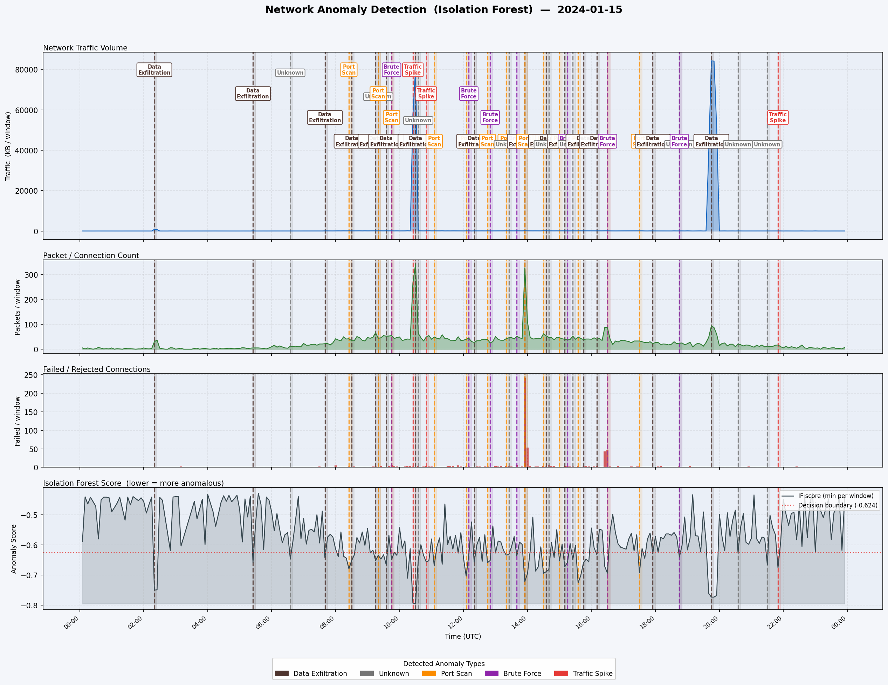
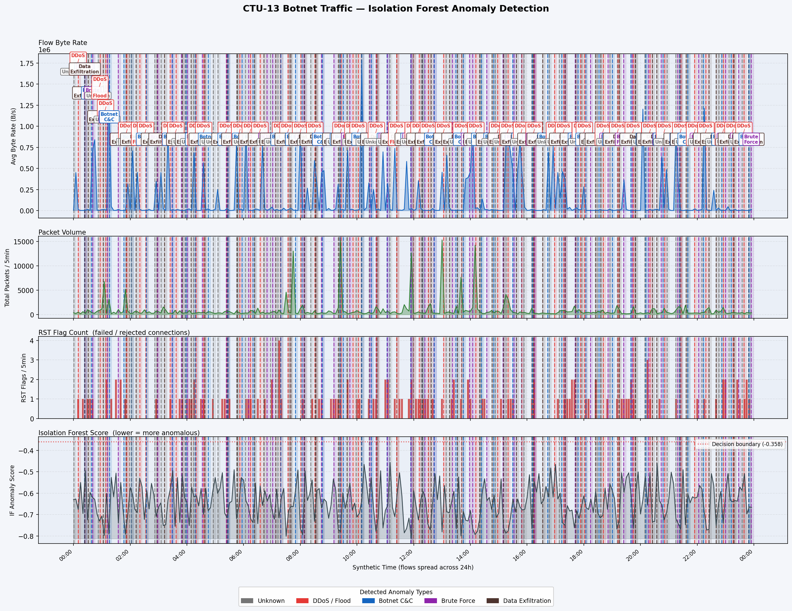

# Network Anomaly Detection System

An unsupervised network anomaly detection system that uses **Isolation Forest** to identify malicious traffic patterns in both PCAP captures and CSV network logs. Tested on real-world botnet traffic from the CTU-13 dataset.

---

## Demo Output



*Time-series view showing traffic volume, connection count, failed connections, and the Isolation Forest anomaly score. Coloured vertical bands mark detected anomaly windows.*

---

## Features

- **Dual input support** — accepts `.pcap` / `.pcapng` files (via scapy) and CSV log files
- **Isolation Forest** — fully unsupervised; no labelled data needed
- **5 anomaly types** automatically classified after detection
- **4-panel time-series graph** with anomaly markers and IF score overlay
- **Real-world validated** — tested on the CTU-13 botnet dataset (55 % attack recall, 69 % precision, zero labels used)
- **Tunable** — `--contamination` and `--window` flags let you adjust sensitivity

---

## Detected Anomaly Types

| Type | Detection Signal |
|---|---|
| Traffic Spike / DDoS | Z-score or IF on byte-rate per time window |
| Port Scan | Many distinct destination ports from one source IP |
| Brute Force | High failed-connection ratio, single target port |
| Data Exfiltration | Sustained high outbound volume (rolling Z-score) |
| Night Activity | Unusual connection count during 00:00–05:59 |
| Botnet C&C | Long idle flows, low packet rate, irregular timing |

---

## How It Works

```
Input (PCAP or CSV)
       │
       ▼
   Parser
  ┌─────────────────────────┐
  │ PCAP → scapy packet     │   extracts: timestamp, src/dst IP,
  │ CSV  → pandas read_csv  │   port, protocol, bytes, TCP flags
  └─────────────────────────┘
       │
       ▼
Feature Engineering (per 5-min window × source IP)
  n_packets, n_bytes, avg_bytes, std_bytes,
  n_dst_ports, n_dst_ips, failed_ratio,
  hour_sin, hour_cos   ← cyclical time encoding
       │
       ▼
  Isolation Forest (sklearn, 200 trees)
  Flags the most isolated feature vectors as anomalies
       │
       ▼
  Rule-based labelling
  Inspects which features deviate most → assigns type + severity
       │
       ▼
  Console report + 4-panel PNG graph
```

---

## Installation

```bash
git clone https://github.com/akrishnash/anamoly_detection.git
cd anamoly_detection
pip install -r requirements.txt
```

**requirements.txt**
```
pandas>=2.0
numpy>=1.24
matplotlib>=3.7
scikit-learn>=1.3
scapy>=2.5
```

> **Note:** scapy requires Npcap (Windows) or libpcap (Linux/macOS) for live capture. For PCAP file reading, no extra driver is needed.

---

## Quick Start

### 1. Generate a sample log and test

```bash
# Create a synthetic log with 5 planted anomalies
python generate_sample_log.py

# Run the Isolation Forest detector
python anomaly_detector_v2.py sample_logs/network_traffic.log
```

### 2. Generate a sample PCAP and test

```bash
python generate_sample_pcap.py
python anomaly_detector_v2.py sample_logs/network_traffic.pcap
```

### 3. Run on your own file

```bash
# Any PCAP
python anomaly_detector_v2.py /path/to/capture.pcap

# Any CSV log (must have columns: timestamp, src_ip, dst_ip, dst_port, bytes, status)
python anomaly_detector_v2.py /path/to/logs.csv

# Tune sensitivity (default: 2 % contamination, 5-min window)
python anomaly_detector_v2.py capture.pcap --contamination 0.03 --window 10min --out report.png
```

### 4. Real-world CTU-13 botnet dataset

```bash
# Download the dataset (one-time)
curl -L https://raw.githubusercontent.com/imfaisalmalik/CTU13-CSV-Dataset/main/CTU13_Attack_Traffic.csv \
     -o sample_logs/CTU13_Attack_Traffic.csv

curl -L https://raw.githubusercontent.com/imfaisalmalik/CTU13-CSV-Dataset/main/CTU13_Normal_Traffic.csv \
     -o sample_logs/CTU13_Normal_Traffic.csv

# Run the CTU-13 specific runner
python run_ctu13.py
```

---

## File Structure

```
anamoly_detection/
│
├── anomaly_detector.py        # v1 — statistical rules (Z-score, frequency)
├── anomaly_detector_v2.py     # v2 — Isolation Forest, PCAP + CSV input
├── run_ctu13.py               # Real-world CTU-13 botnet runner
│
├── generate_sample_log.py     # Generates sample_logs/network_traffic.log
├── generate_sample_pcap.py    # Generates sample_logs/network_traffic.pcap
│
├── requirements.txt
│
├── anomaly_report.png         # Sample output — v1 statistical detector
├── anomaly_report_v2.png      # Sample output — v2 Isolation Forest (CSV)
├── anomaly_report_pcap.png    # Sample output — v2 Isolation Forest (PCAP)
├── anomaly_report_ctu13.png   # Sample output — CTU-13 real botnet data
│
└── sample_logs/
    └── network_traffic.log    # Generated synthetic log (7,722 entries)
```

---

## Sample Log Format (CSV)

```
timestamp,src_ip,dst_ip,dst_port,protocol,bytes,status,duration_ms
2024-01-15 08:23:45,192.168.1.10,10.0.0.1,443,TCP,1240,SUCCESS,45
2024-01-15 08:23:47,192.168.1.22,10.0.88.5,80,TCP,890,SUCCESS,33
2024-01-15 10:28:01,45.33.32.156,192.168.1.3,443,TCP,98304,SUCCESS,12
```

---

## Real-World Results — CTU-13 Botnet Dataset

Dataset: [CTU-13](https://www.stratosphereips.org/datasets-ctu13) — real botnet captures (Neris, Rbot, Menti, etc.) mixed with normal traffic.  
No labels used during training.

```
              precision    recall    f1-score
Normal            0.630     0.757     0.687
Attack            0.695     0.555     0.617
accuracy                              0.656   (12,000 flows)

Confusion matrix:
  TN = 4,541   FP = 1,459
  FN = 2,671   TP = 3,329
```

**55 % of real attacks caught with 70 % precision — fully unsupervised.**



---

## Detector Versions

| | v1 `anomaly_detector.py` | v2 `anomaly_detector_v2.py` |
|---|---|---|
| Algorithm | Statistical rules (Z-score, frequency thresholds) | Isolation Forest (sklearn) |
| Input | CSV log only | CSV log + PCAP |
| Training | None (hard thresholds) | Unsupervised fit on input data |
| Tunable | Threshold constants in source | `--contamination`, `--window` flags |
| Output | PNG report | PNG report + IF score panel |

---

## Synthetic Anomalies (for testing)

The sample generators plant 5 anomalies at known times:

| # | Type | Time | Description |
|---|---|---|---|
| 1 | Night Activity | 02:20 | Off-hours burst from `192.168.1.50` |
| 2 | Traffic Spike | 10:28 | High-volume flood from `45.33.32.156` |
| 3 | Port Scan | 13:58 | Sequential SYN sweep by `192.168.100.50` |
| 4 | Brute Force | 16:27 | SSH SYN+RST storm from `192.168.200.1` |
| 5 | Data Exfiltration | 19:43 | Sustained large outbound from `192.168.1.25` |

---

## Dataset Credit

- **CTU-13**: Sebastián García, Martin Grill, Jan Stiborek, Alejandro Zunino.  
  *"An empirical comparison of botnet detection methods"*, Computers & Security, 2014.  
  [https://www.stratosphereips.org/datasets-ctu13](https://www.stratosphereips.org/datasets-ctu13)

- **CSV conversion**: [imfaisalmalik/CTU13-CSV-Dataset](https://github.com/imfaisalmalik/CTU13-CSV-Dataset)
