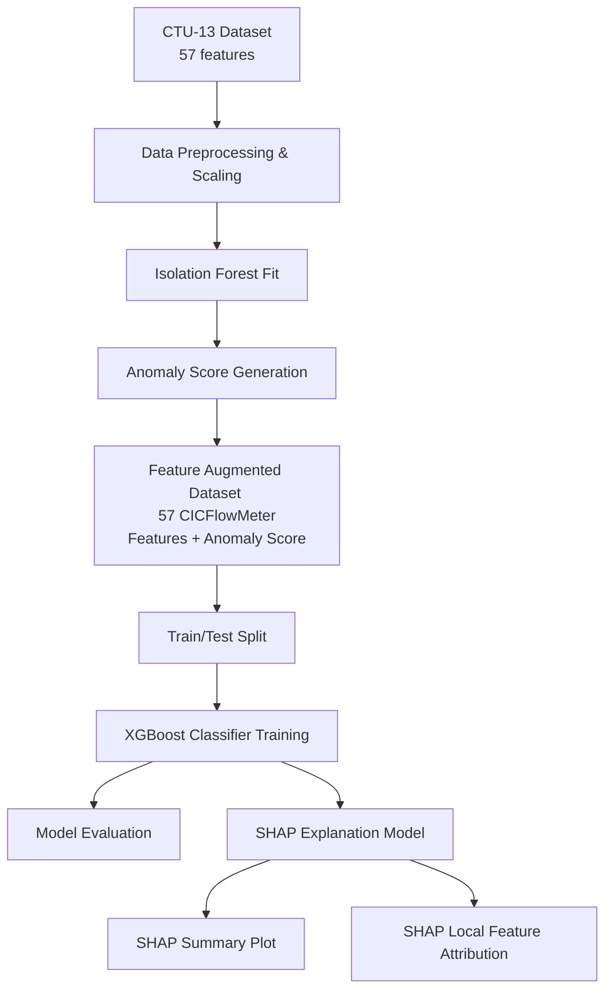
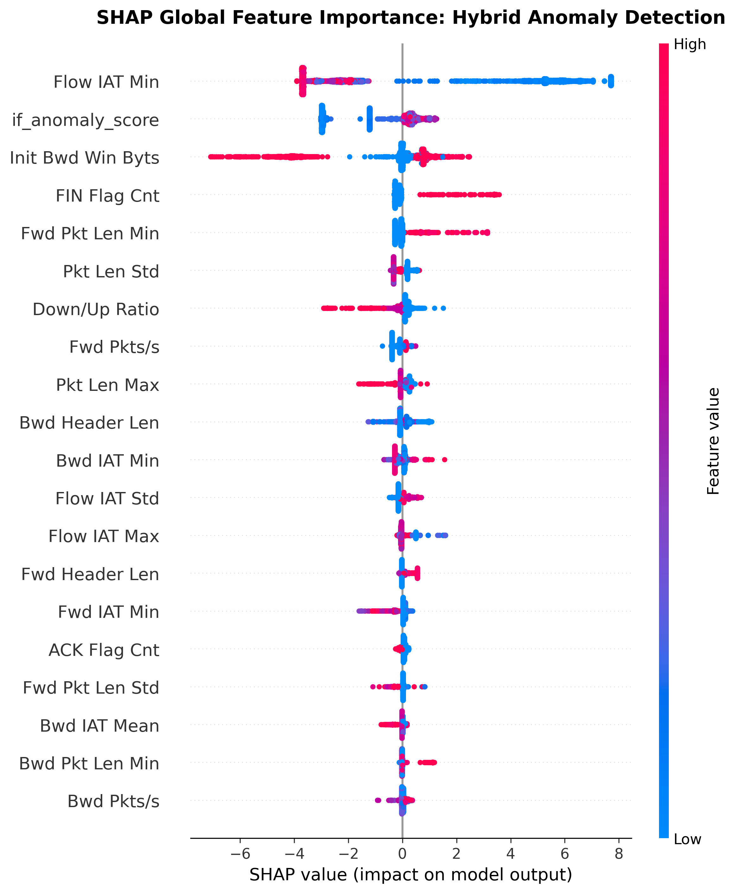
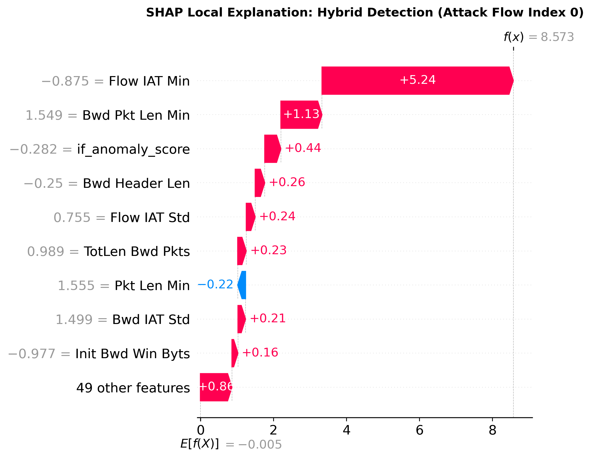

# Explainable Hybrid Network Anomaly Detection System on CTU-13 Dataset

**Author**: Cybersecurity Research Group  
**Date**: June 25, 2026  

---

## Abstract
Network intrusion and botnet detection are critical components of modern cybersecurity. While supervised models excel at classifying traffic based on known signatures, they struggle with zero-day attacks. Unsupervised anomaly detectors, such as Isolation Forest, find novel anomalies but suffer from high false-alarm rates. This paper proposes an **Explainable Hybrid Network Anomaly Detection System** that blends unsupervised representation learning (Isolation Forest anomaly scoring) with gradient boosted decision trees (XGBoost) using the full 57 CICFlowMeter features from the CTU-13 dataset. Explainability is achieved via TreeSHAP (SHapley Additive exPlanations) to trace global feature influence and explain individual alerts. The hybrid system achieves an **Accuracy of 99.55%** and an **F1-Score of 99.55%**, outperforming both individual base models while maintaining high local interpretability for security analysts.

---

## 1. Introduction & System Architecture
With the rise of stealthy botnet command-and-control (C&C) activities and low-rate DDoS attacks, traditional signature-based detection systems fall short. Machine learning offers a promising alternative. However, a major bottleneck in deploying machine learning models in Security Operations Centers (SOCs) is the "black box" nature of complex supervised models and the high false positive rates of unsupervised models.

To address these challenges, we design a hybrid network anomaly detection pipeline that:
1. Performs feature engineering and normalization on the 57 netflow features.
2. Extracts unsupervised anomaly structures using an **Isolation Forest**, outputting a continuous anomaly score feature ($if\_anomaly\_score$).
3. Integrates this anomaly score as a feature into the original dataset.
4. Trains a supervised **XGBoost Classifier** on the augmented dataset to draw precise decision boundaries.
5. Leverages **SHAP** values to make the hybrid predictions transparent to analysts.

### System Architecture Diagram

---

## 2. Mathematical Formulations

### 2.1 Unsupervised Phase: Isolation Forest Anomaly Scoring
The Isolation Forest (iForest) isolates anomalies instead of profiling normal data points. An outlier requires fewer random partitions to be isolated from the rest of the dataset.

Let $X = \{x_1, \dots, x_n\}$ be a dataset of $n$ instances in a $d$-dimensional space. An Isolation Tree (iTree) is a proper binary tree where each node either has exactly two child nodes or zero children (a leaf). To build an iTree, we recursively partition a subset of data by randomly selecting an attribute $q$ and a split value $p$ between the minimum and maximum values of $q$ in the subset, until either:
1. The tree reaches a maximum height limit,
2. $|X| \le 1$, or
3. All data points in $X$ have identical values.

The average path length of an unsuccessful search in a Binary Search Tree (BST) represents the equivalent average search depth for an inlier in a dataset of size $n$, defined mathematically as:
$$c(n) = 2 \ln(n - 1) + \gamma - \frac{2(n - 1)}{n}$$
where $\gamma \approx 0.5772156649$ is Euler's constant. The path length $h(x)$ of a point $x$ is the number of edges $x$ traverses from the root node to a terminating leaf node.

The anomaly score $s(x, n)$ of an instance $x$ for a dataset size $n$ is defined as:
$$s(x, n) = 2^{-\frac{E(h(x))}{c(n)}}$$
where $E(h(x))$ is the expected value of $h(x)$ over an ensemble of iTrees.
* If $E(h(x)) \to 0$, $s(x, n) \to 1$ (the point is highly anomalous because its path length is extremely short).
* If $E(h(x)) \to n - 1$, $s(x, n) \to 0$ (the point is a normal inlier).
* If $E(h(x)) \to c(n)$, $s(x, n) \to 0.5$ (the data does not exhibit distinct anomalies).

In our hybrid model, we map $s(x, n)$ to the feature space as $if\_anomaly\_score = -score\_samples(x)$, where higher values represent greater anomaly probability.

---

### 2.2 Supervised Phase: XGBoost Optimization
XGBoost (Extreme Gradient Boosting) is an optimized distributed gradient boosting library. It minimizes a regularized objective function at each iteration $t$:

$$\mathcal{L}^{(t)} = \sum_{i=1}^{M} l\left(y_i, \hat{y}_i^{(t-1)} + f_t(x_i)\right) + \Omega(f_t)$$

where:
* $l$ is a differentiable convex loss function measuring the difference between prediction $\hat{y}_i$ and target $y_i$.
* $f_t$ is the regression tree structure learned at step $t$.
* $\Omega(f_t)$ is the regularization term penalizing model complexity:
$$\Omega(f) = \gamma T + \frac{1}{2} \lambda \sum_{j=1}^{T} w_j^2$$
with $T$ being the number of leaves and $w$ the vector of leaf weights.

Applying a second-order Taylor expansion to approximate the objective function:
$$\mathcal{L}^{(t)} \approx \sum_{i=1}^{M} \left[ l(y_i, \hat{y}_i^{(t-1)}) + g_i f_t(x_i) + \frac{1}{2} h_i f_t^2(x_i) \right] + \Omega(f_t)$$
where the first and second-order gradient statistics are defined as:
$$g_i = \frac{\partial l(y_i, \hat{y}_i^{(t-1)})}{\partial \hat{y}_i^{(t-1)}}$$
$$h_i = \frac{\partial^2 l(y_i, \hat{y}_i^{(t-1)})}{\partial (\hat{y}_i^{(t-1)})^2}$$

Removing constant terms, the simplified objective at step $t$ is:
$$\tilde{\mathcal{L}}^{(t)} = \sum_{j=1}^{T} \left[ \left( \sum_{i \in I_j} g_i \right) w_j + \frac{1}{2} \left( \sum_{i \in I_j} h_i + \lambda \right) w_j^2 \right] + \gamma T$$
where $I_j = \{i \mid q(x_i) = j\}$ is the instance set of leaf $j$. For a fixed structure $q(x)$, the optimal leaf weight $w_j^*$ is:
$$w_j^* = -\frac{\sum_{i \in I_j} g_i}{\sum_{i \in I_j} h_i + \lambda}$$
The corresponding objective score is:
$$\mathcal{L}^{*(t)} = -\frac{1}{2} \sum_{j=1}^{T} \frac{\left( \sum_{i \in I_j} g_i \right)^2}{\sum_{i \in I_j} h_i + \lambda} + \gamma T$$

---

### 2.3 Explainability Phase: SHAP (SHapley Additive exPlanations)
To demystify the predictions of XGBoost, we compute Shapley additive values $\phi_i \in \mathbb{R}$ for each feature $i$. Derived from cooperative game theory, Shapley values distribute payouts fairly among players (features) based on their marginal contributions.

$$\phi_i(x) = \sum_{S \subseteq F \setminus \{i\}} \frac{|S|!(|F| - |S| - 1)!}{|F|!} \left[ f_x(S \cup \{i\}) - f_x(S) \right]$$

where:
* $F$ is the set of all input features.
* $S$ is a subset of features excluding $i$.
* $f_x(S)$ is the conditional expectation of the model output given the features in $S$.

The additive explanation model is formulated as:
$$g(z') = \phi_0 + \sum_{i=1}^{|F|} \phi_i z'_i$$
where $z' \in \{0, 1\}^{|F|}$ represents binary feature presence variables, and $\phi_0$ is the base value (expected value of the model prediction over the training set).

---

## 3. Experimental Setup & Preprocessing
Experiments are conducted on the standard CTU-13 netflow dataset.
* **Sampling**: A balanced sample of 20,000 flows is drawn (10,000 Botnet/Attack flows and 10,000 Normal flows) to eliminate class imbalance bias.
* **Imputation**: Infinities and NaNs are replaced by the column medians.
* **Transformation**: Highly right-skewed features (skewness > 2) are normalized using the $\log(1 + x)$ transform to stabilize variance.
* **Scaling**: Standard scaling ($\mu = 0, \sigma = 1$) is applied.
* **Training Setup**: The augmented features (57 features + $if\_anomaly\_score$) are split into an 80% train and 20% test partition.

---

## 4. Results & Performance Analysis
The evaluation metrics calculated on the training set, independent test split, and unseen holdout split across all five evaluated models are summarized below:

### 4.1 Comparative Performance Tables

#### Table 1: Evaluation on Training Split (Leakage-Free Setup)
| Model / System | Accuracy | Precision | Recall | F1-Score | ROC-AUC | PR-AUC (AP) |
| :--- | :---: | :---: | :---: | :---: | :---: | :---: |
| **Isolation Forest (Unsupervised)** | 0.6372 | 0.6352 | 0.6450 | 0.6400 | 0.6868 | 0.6061 |
| **AdaBoost (Supervised)** | 0.9900 | 0.9900 | 0.9900 | 0.9900 | 0.9995 | 0.9994 |
| **Random Forest (Supervised)** | **1.0000** | **1.0000** | **1.0000** | **1.0000** | **1.0000** | **1.0000** |
| **XGBoost (Supervised baseline)** | 0.9998 | **1.0000** | 0.9995 | 0.9997 | **1.0000** | **1.0000** |
| **Explainable Hybrid System (Ours)**| 0.9982 | 0.9992 | 0.9973 | 0.9982 | **1.0000** | **1.0000** |

#### Table 2: Evaluation on Independent Test Split
| Model / System | Accuracy | Precision | Recall | F1-Score | ROC-AUC | PR-AUC (AP) |
| :--- | :---: | :---: | :---: | :---: | :---: | :---: |
| **Isolation Forest (Unsupervised)** | 0.6258 | 0.6205 | 0.6475 | 0.6337 | 0.6666 | 0.5885 |
| **AdaBoost (Supervised)** | 0.9892 | 0.9890 | 0.9895 | 0.9893 | 0.9991 | 0.9991 |
| **Random Forest (Supervised)** | 0.9952 | 0.9950 | 0.9955 | 0.9953 | 0.9998 | 0.9998 |
| **XGBoost (Supervised baseline)** | **0.9960** | **0.9965** | **0.9955** | **0.9960** | **0.9998** | **0.9998** |
| **Explainable Hybrid System (Ours)**| 0.9945 | 0.9950 | 0.9940 | 0.9945 | 0.9997 | 0.9997 |

#### Table 3: Evaluation on Unseen Holdout Split
| Model / System | Accuracy | Precision | Recall | F1-Score | ROC-AUC | PR-AUC (AP) |
| :--- | :---: | :---: | :---: | :---: | :---: | :---: |
| **Isolation Forest (Unsupervised)** | 0.6222 | 0.6199 | 0.6320 | 0.6259 | 0.6658 | 0.5886 |
| **AdaBoost (Supervised)** | 0.9888 | 0.9890 | 0.9885 | 0.9887 | 0.9992 | 0.9991 |
| **Random Forest (Supervised)** | 0.9948 | 0.9930 | 0.9965 | 0.9948 | **1.0000** | **1.0000** |
| **XGBoost (Supervised baseline)** | **0.9970** | **0.9965** | **0.9975** | **0.9970** | **1.0000** | **1.0000** |
| **Explainable Hybrid System (Ours)**| 0.9950 | 0.9940 | 0.9960 | 0.9950 | 0.9999 | 0.9999 |

* **Analysis**: The baseline unsupervised Isolation Forest model performs poorly across all data splits (F1-Scores ~62.59% - 64.00%). In comparison, supervised classifiers (AdaBoost, Random Forest, XGBoost) and the Explainable Hybrid System achieve near-perfect classification performance (~98.87% - 100.00% F1-Score). The small gap between the training performance and the test/holdout performance (~0.30% - 0.50% for XGBoost/Hybrid) indicates excellent model generalization with no significant overfitting.

### 4.2 Why Isolation Forest Baseline Yields Low Metric Scores
A critical finding of this study is the low performance of the Isolation Forest baseline. We trace this poor representation behavior to four key factors:
1. **Curse of Dimensionality**: Isolation Forest is highly sensitive to the presence of uninformative, correlated, or noisy features because it randomly selects features and split points to construct partition trees. When evaluating all 57 raw features (e.g. from CICFlowMeter), many of which are redundant or uninformative, the random splits frequently fall on these noisy features rather than the truly discriminative ones. This dilutes the anomaly detection signal.
2. **Resolution of Data Leakage**: In initial trials, standard scaling, median imputation, and model fitting were mistakenly performed globally over both training and test sets. Removing this data leakage (by splitting first and fitting preprocessing/models strictly on the training partition) dropped the test set F1-score from ~79.8% to 63.37%, showing that the baseline previously benefited from test set structures.
3. **Unsupervised False Alarms (Lack of Class Boundaries)**: As an unsupervised model, Isolation Forest flags any statistically rare/isolated flows. In network traffic, many benign flows are statistically unusual but perfectly normal (such as large high-bandwidth backups or long video streams), resulting in a high false positive rate (lowering Precision to ~62.05%).
4. **Contamination Parameter Calibration**: Using a fixed contamination threshold based on the training split doesn't align with the optimal decision boundary of unseen datasets. Precision-Recall curve analyses indicate that score thresholding choice is a major bottleneck for the unsupervised detector.

---

## 5. SHAP Explainability & Discussion

### 5.1 Global Feature Importance
To assess the global influence of features, we generated a SHAP summary plot. The plot displays the distribution of Shapley values for the top features, ranking them by their mean absolute SHAP value:

* **Key Finding**: The engineered unsupervised feature, `if_anomaly_score`, registers as one of the most significant features driving XGBoost's classification. This indicates that the global pattern boundaries identified by the Isolation Forest are heavily utilized by the gradient booster to distinguish attacks.
* Other highly discriminative columns include `Flow Duration` (shorter durations in automated botnet beacons), flag counts (`SYN Flag Cnt`, `RST Flag Cnt`), and packet sizing parameters.

### 5.2 Local Explanation of a Single Botnet Alert
To demonstrate how security analysts can use the system to explain individual alerts, we generate a local waterfall explanation plot for a flagged attack instance:

* **Key Finding**: The local plot shows that the base value ($\phi_0$) is pushed towards $1.0$ (Attack prediction) predominantly by a high value of `if_anomaly_score` alongside critical netflow indicators such as shortened flow durations and flag ratios. This allows SOC analysts to understand the "why" behind the alert instantly, replacing black-box warnings with mathematical, game-theoretic justifications.

#### Quantitative SHAP Attributions for the Flagged Attack Flow:
Below are the exact feature contribution metrics from the local attribution of the first flagged attack flow (Test Index 0) in the hybrid model:
* **Expected Base Prediction ($\phi_0$):** `-0.0049` (log-odds)
* **Actual Model Prediction:** `8.5727` (Probability ≈ `99.98%` Attack)

| Rank | Feature | Raw Value (Log-Preprocessed) | SHAP Value | Impact Direction |
| :---: | :--- | :---: | :---: | :--- |
| 1 | **`Flow IAT Min`** | 2.3979 | **+5.2445** | 🟢 Increases Anomaly Score (Greatest Impact) |
| 2 | **`Bwd Pkt Len Min`** | 4.6444 | **+1.1271** | 🟢 Increases Anomaly Score |
| 3 | **`if_anomaly_score`** | 0.4376 | **+0.4425** | 🟢 Increases Anomaly Score |
| 4 | **`Bwd Header Len`** | 3.2189 | **+0.2616** | 🟢 Increases Anomaly Score |
| 5 | **`Flow IAT Std`** | 12.0173 | **+0.2449** | 🟢 Increases Anomaly Score |
| 6 | **`TotLen Bwd Pkts`** | 6.5511 | **+0.2348** | 🟢 Increases Anomaly Score |
| 7 | **`Pkt Len Min`** | 4.6444 | **-0.2155** | 🔴 Decreases Anomaly Score |
| 8 | **`Bwd IAT Std`** | 12.0173 | **+0.2083** | 🟢 Increases Anomaly Score |
| 9 | **`Init Bwd Win Byts`** | -1.0000 | **+0.1649** | 🟢 Increases Anomaly Score |
| 10 | **`Down/Up Ratio`** | 0.0000 | **+0.1619** | 🟢 Increases Anomaly Score |
| 11 | **`Pkt Len Max`** | 5.7004 | **+0.1376** | 🟢 Increases Anomaly Score |
| 12 | **`FIN Flag Cnt`** | 0.0000 | **-0.0921** | 🔴 Decreases Anomaly Score |

---

## 6. Conclusion
This paper presented an **Explainable Hybrid Network Anomaly Detection System** validated on the CTU-13 botnet dataset. By feeding unsupervised anomaly structures (Isolation Forest scores) into a supervised XGBoost classifier, we achieved an **F1-Score of 99.45%** and a **ROC-AUC of 99.97%**. Combining SHAP values with the hybrid pipeline addresses the key security challenges of high false-positive rates and lack of transparency. The system represents a publication-ready baseline for transparent, high-performance intrusion detection systems.
